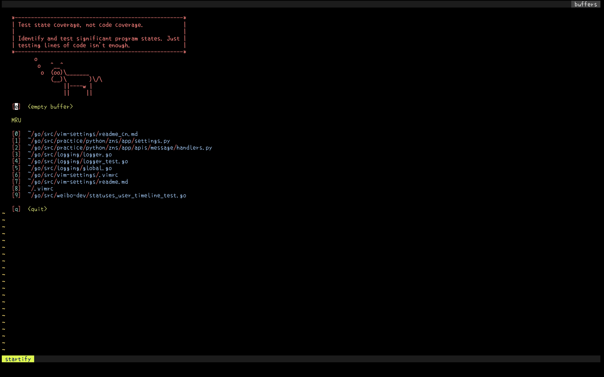
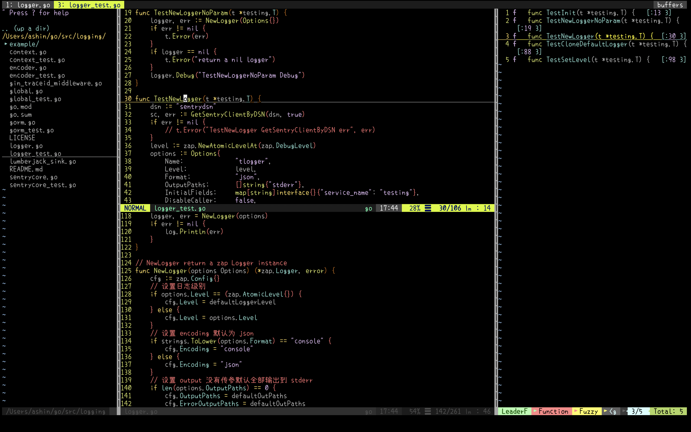
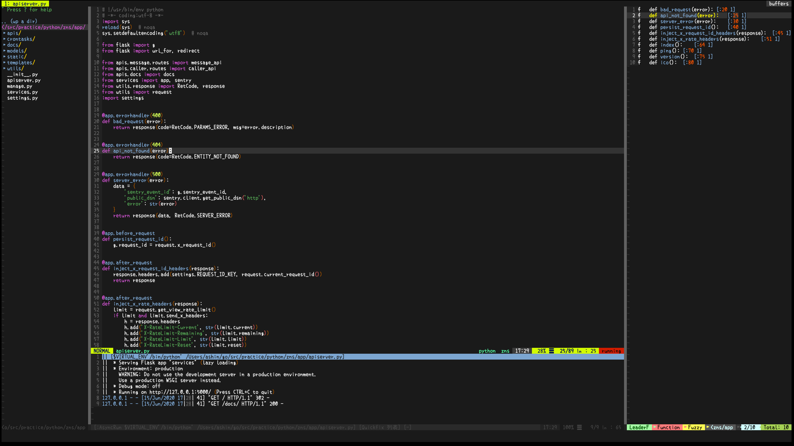
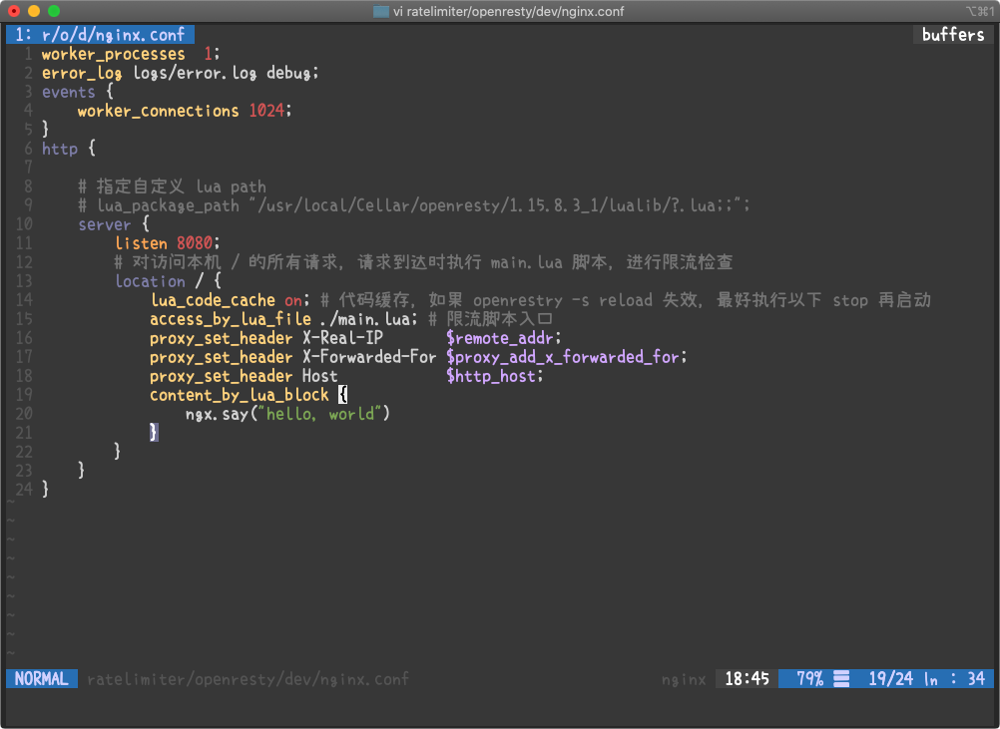
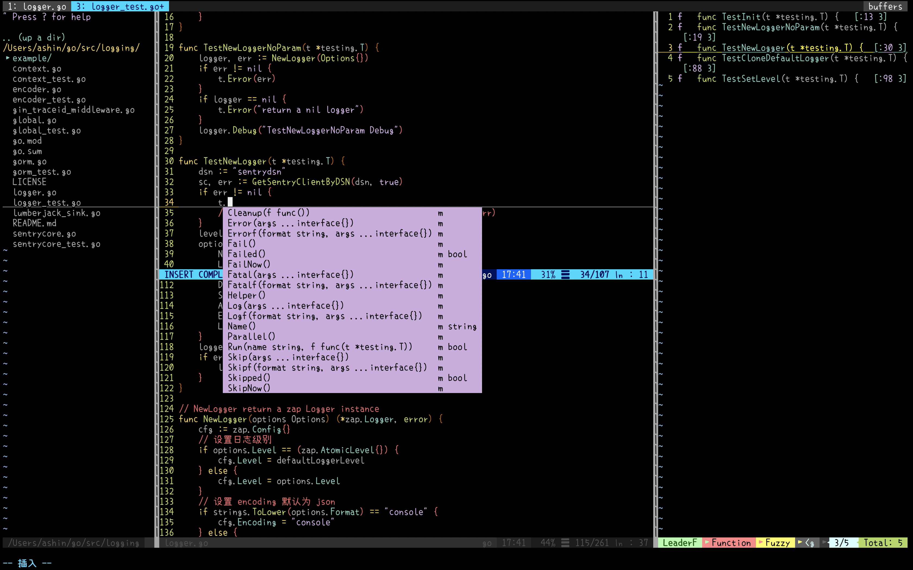
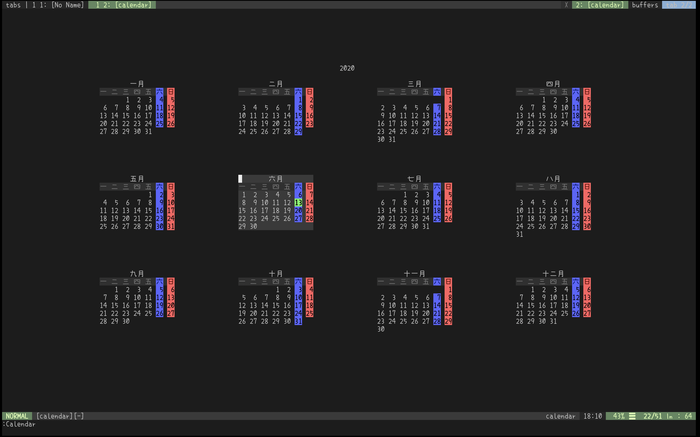
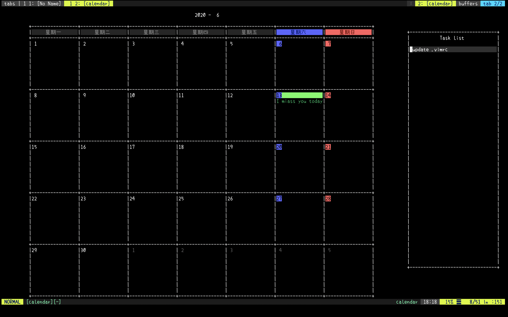
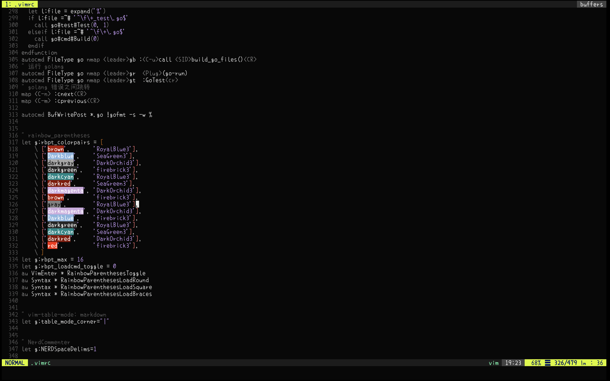
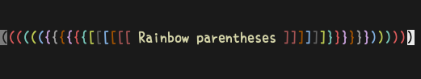
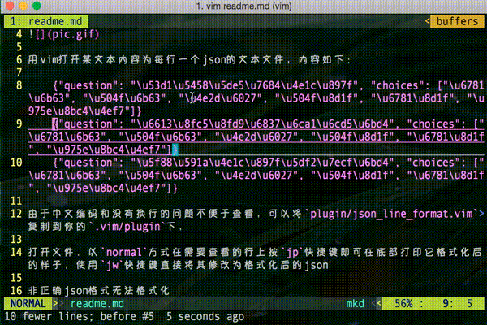

# my-vimrc

[中文文档](./readme_cn.md)

This repository stores my VIM configuration files. Usually, VIM is mainly used to write Golang, Python and Markdown.

At present, there are two branches. The master branch is the configuration of the old version of vim and is no longer maintained.

The vim-8 branch is the configuration currently being used on macOS with VIM 8.1.

## VIM Version

```
VIM - Vi IMproved 8.1 (2018 May 18, compiled Oct 15 2019 10:20:59)
macOS version
```

## Features

- Automatically detect and install the `vim-plug` plugins Manager
- Correct analysis of Chinese without disorder
- Cancel backup, do not generate swap file automatically
- The status bar is beautiful and informative with airline
- Automatic loading takes effect immediately after configuration modification, and automatically loads opened files after modification
- Use ALE automatic syntax detection and auto repair
- Text search supports highlighting and typing instant search and intelligent case ignoring
- Mouse operation supported
- Quick switch file line number display
- Saving a file automatically removes line endings and blank lines at the end of the file
- Use 4 spaces to fill in the tab, smart indent, backspace and smart delete space
- Support code collapse by indentation
- After exiting VIM, the content is displayed on the terminal screen and can be used for viewing and copying
- Always jump to the last cursor position when opening a file
- After exiting VIM, you can still undo the last edit
- With a large number of functions, easy to remember and press key mapping
- j|k keep the cursor in the middle of the screen when moving the line
- Copy all the contents of the file to the clipboard in Ctrl + C normal mode, and copy the selected contents to the clipboard in visual mode
- CTRL + V paste clipboard contents as is
- Support to view file directory tree
- Use LeaderF to display a list of functions
- Run the current Python script with one click and support virtualenv
- One click Format JSON
- Spaces can be added between numbers and English
- Move or resize windows quickly
- Using leaderf to support file obfuscation
- One click Add or cancel comment is supported
- Random theme color matching and one click switching
- Elegant startup interface
- Integrated VIM go plug-in, gopher VIM party standard
- Support bracket pair highlighting
- Support table mode to quickly edit and format markdown tables
- Support color value Preview
- Support asynchronous shell command execution
- Support to display git diff tag
- Support multi line editing
- Support quick modification of wrapping characters at both ends of words
- Use youcompleteme to support code auto completion
- Integrate vimwiki
- Auto pair edit parentheses, quotes
- Support display screen calendar
- Support nginx configuration highlighting
- Support markdown real-time preview

## Plugins

**use vim-plug manage plugins**： the `.vimrc` will automatic download the vim-plug

- [nerdtree](https://github.com/scrooloose/nerdtree) A tree explorer plugin for vim.
- [nerdcommenter](https://github.com/scrooloose/nerdcommenter) Vim plugin for intensely orgasmic commenting
- [vim-airline](https://github.com/vim-airline/vim-airline) lean & mean status/tabline for vim that's light as air.
- [vim-colorschemes](https://github.com/axiaoxin/vim-colorschemes) I <3 these vim colorschemes
- [vim-plugin-random-colorscheme-picker](https://github.com/sunuslee/vim-plugin-random-colorscheme-picker) Pick the VIM colorscheme that you are destined to be with.:)
- [vim-startify](https://github.com/mhinz/vim-startify) A fancy start screen for Vim
- [vim-go](https://github.com/fatih/vim-go) Go development plugin for Vim
- [rainbow_parentheses.vim](https://github.com/kien/rainbow_parentheses.vim) Better Rainbow Parentheses.
- [vim-table-mode](https://github.com/dhruvasagar/vim-table-mode) VIM Table Mode for instant table creation.
- [vim-coloresque](https://github.com/gko/vim-coloresque) css/less/sass/html color preview for vim.
- [asyncrun.vim](https://github.com/skywind3000/asyncrun.vim) Run Async Shell Commands in Vim 8.0 / NeoVim and Output to Quickfix Window.
- [vim-signify](https://github.com/mhinz/vim-signify) Show a diff using Vim its sign column.
- [vim-json-line-format](https://github.com/axiaoxin/vim-json-line-format) format json line in Vim.
- [vim-visual-multi](https://github.com/mg979/vim-visual-multi) Multiple cursors project for vim/neovim.
- [vim-surround](https://github.com/tpope/vim-surround) quoting/parenthesizing made simple
- [LeaderF](https://github.com/Yggdroot/LeaderF) An asynchronous fuzzy finder which is used to quickly locate files, buffers,mrus, tags, etc. in large project
- [YouCompleteMe](https://github.com/ycm-core/YouCompleteMe) A code-completion engine for Vim.
- [vim-gutentags](https://github.com/ludovicchabant/vim-gutentags) A Vim plugin that manages your tag files.
- [gutentags_plus](https://github.com/skywind3000/gutentags_plus) The right way to use gtags with gutentags.
- [ale](https://github.com/dense-analysis/ale) Check syntax in Vim asynchronously and fix files, with Language Server Protocol (LSP) support.
- [vimwiki](https://github.com/vimwiki/vimwiki) Personal Wiki for Vim
- [ultisnips](https://github.com/SirVer/ultisnips) The ultimate snippet solution for Vim
- [vim-snippets](https://github.com/honza/vim-snippets) vim-snipmate default snippets
- [auto-pairs](https://github.com/jiangmiao/auto-pairs) Insert or delete brackets, parens, quotes in pair.
- [calendar.vim](https://github.com/itchyny/calendar.vim) A calendar application for Vim
- [nginx.vim](https://github.com/chr4/nginx.vim) Improved nginx vim plugin (incl. syntax highlighting)
- [vim-instant-markdown](https://github.com/suan/vim-instant-markdown) Instant Markdown previews from VIm!

## Custom key mapping

- switch buffer: `]b` `[b`
- switch tab: `]t` `[t`
- copy (all/selected) content：`Ctrl-c`、`Ctrl-v`
- write read only file: `w!!`
- line number toggle: `<F2>`
- nerdtree toggle: `<F3>`
- function list: `<F4>`
- run python script: `<F5>`
- open a new tab: `<F6>`
- lint fix: `<F8>`
- format current json file: `<F9>`
- automatically wrap spaces for English words and numbers in Chinese: `<F10>`
- wrap "/' for a word: `\w'`、`\w"`
- change surround: `csXY` `dsX`
- case conversion and automatic prefixing \_ (for abc`D`ef -> abc_def): `!`
- delete the current character and case the following characters (for abc`_`def -> abcDef): `@`
- continue indent text to left or right on select/normal mode: `>` `<`
- switch window: `Ctrl-k` `Ctrl-j` `Ctrl-h` `Ctrl-l`
- resize window: `Ctrl-Shift-arrows`
- close quickfix window: `\q`
- fuzzy search file: `\f` `\m`
- format single json line in a text file: `\wj` `\pj`
- comment/uncomment: `\cc` `\cu`
- markdown table mode: `\tm`
- build go file: `\gb`
- run go file: `\gr`
- run go test: `\gt`
- code complete: `Ctrl-z`
- vimwiki mode: `\ww`
- expand snips: `Ctrl-e`
- change random colorscheme: `\c
- copy content to system clipboard: `Ctrl-c`
- show referrers for go file: `\r`

## Screenshots

Some screenshots may not be up-to-date, just for reference.

Launch interface



Daily coding



Open a go file


Open a python file and run


Open nginx configuration file



Code complete



File search


Show calendar





Color preview



Markdown preview


Rainbow parentheses



Format single json line in text file



Markdown table mode

<a href="http://www.youtube.com/watch?v=9lVQ0VJY3ps"></a>

## Install & Usage

[!] VIM version must be above 8 and python version is 3.x.x

For VIM upgrade, please refer to wiki: <https://github.com/axiaoxin/my-vimrc/wiki/Upgrade-VIM-to-8.x>

For Python upgrade, please refer to wiki: <https://github.com/axiaoxin/my-vimrc/wiki/Upgrade-Python-to-3.x>

### External dependence

Using this configuration requires the following commands to install some external dependencies:

```
brew install cmake macvim mono go nodejs pygments global cppcheck
brew unlink ctags && brew install --HEAD universal-ctags/universal-ctags/universal-ctags
[sudo] pip install isort yapf flake8 autopep8 pylint
npm -g install instant-markdown-d prettier markdownlint
```

### Install plugins

Copy the `.vimrc` file to your `$HOME` directory, open VIM, execute `:PlugInstall`, and wait for the plugins installation to complete.

Install vim-go binaries: `:GoInstallBinaries`

Setting the YouCompleteMe: <https://github.com/ycm-core/YouCompleteMe#macos>

```
cd ~/.vim/plugged/YouCompleteMe
python install.py --all
```

# Stargazers over time

[](https://starchart.cc/axiaoxin/my-vimrc)
